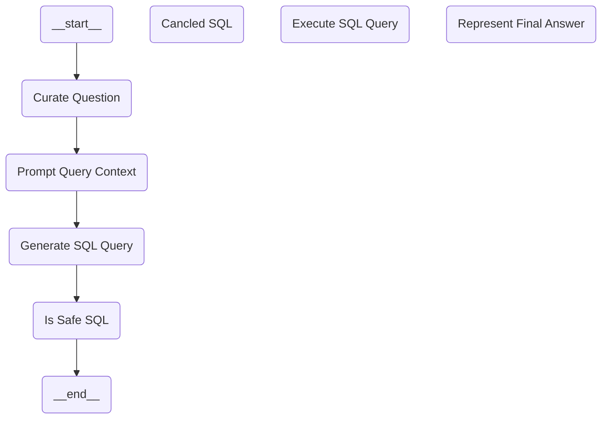

```mermaid
---
config:
  flowchart:
    curve: linear
---
graph TD;
	__start__(<p>__start__</p>)
	Curate\20Question(Curate Question)
	Prompt\20Query\20Context(Prompt Query Context)
	Generate\20SQL\20Query(Generate SQL Query)
	Is\20Safe\20SQL(Is Safe SQL)
	Cancled\20SQL(Cancled SQL)
	Execute\20SQL\20Query(Execute SQL Query)
	Represent\20Final\20Answer(Represent Final Answer)
	__end__(<p>__end__</p>)
	Curate\20Question --> Prompt\20Query\20Context;
	Generate\20SQL\20Query --> Is\20Safe\20SQL;
	Prompt\20Query\20Context --> Generate\20SQL\20Query;
	__start__ --> Curate\20Question;
	Is\20Safe\20SQL --> __end__;
	classDef default fill:#f2f0ff,line-height:1.2
	classDef first fill-opacity:0
	classDef last fill:#bfb6fc

```